# Compiler Nots

_This compilation highlights key points from each chapter that I deem essential for memorization. Following each chapter, you'll find solutions to the challenges presented, providing a comprehensive understanding of the material._

[](https://github.com/Hussein119/Compiler-Nots)

## References

- [Crafting Interpreters book](https://craftinginterpreters.com)
- [Crafting Interpreters Repo](https://github.com/munificent/craftinginterpreters)
- [Head First Design Patterns](https://www.oreilly.com/library/view/head-first-design/9781492077992/)

## Table of Contents

- [Chapter 1: Introduction](#chapter-1-introduction)
- [Chapter 2: A Map of the Territory](#chapter-2-a-map-of-the-territory)
- [Chapter 3: The Lox Language](#chapter-3-the-lox-language)
- [Chapter 4: Scanning](#chapter-4-scanning)
- [Visitor Design Pattern](#visitor-design-pattern)
- [Chapter 5: Representing Code](#chapter-5-representing-code)
- [Chapter 6: Parsing Expressions](#chapter-6-parsing-expressions)
- [Chapter 7: Evaluating Expressions](#chapter-7-evaluating-expressions)
- [Chapter 8: Statements and State](#chapter-8-statements-and-state)
- [Chapter 9: Control Flow](#chapter-9-control-flow)
- [Chapter 10: Functions](#chapter-10-functions)
- [Chapter 11: Resolving and Binding](#chapter-11-resolving-and-binding)
- [Chapter 12: Classes](#chapter-12-classes)
- [Chapter 13: Inheritance](#chapter-13-inheritance)
- [Chapter 14: Chunks of Bytecode](#chapter-14-chunks-of-bytecode)
- [Chapter 15: A Virtual Machine](#chapter-15-a-virtual-machine)
- [Midterm Exam](#midterm-exam)

## Chapter 1 Introduction

1. little languages = domain-specific languages : These are pidgins
   tailor-built to a specific task.

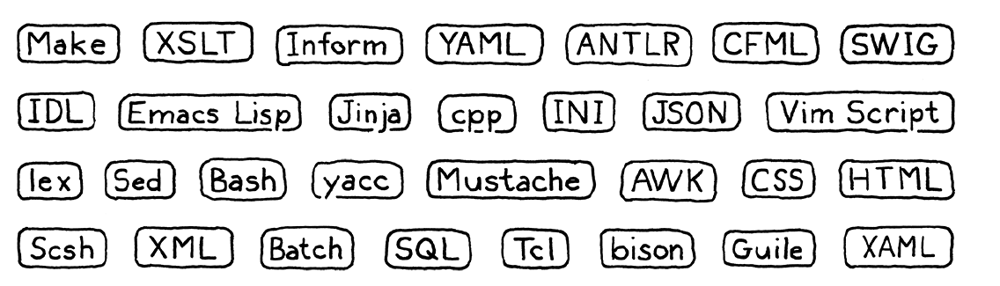

2. A compiler reads files in one language. translates them, and outputs files in another
   language. You can implement a compiler in any language, including the same language it
   compiles, a process called _self-hosting_.
3. You can’t compile your compiler using itself yet, but if you have another compiler for your
   language written in some other language, you use that one to compile your compiler once.
   Now you can use the compiled version of your own compiler to compile future
   versions of itself and you can discard the original one compiled from the other
   compiler. This is called _bootstrapping_ from the image of pulling yourself up by your own
   bootstraps.
4. Bytecode is an intermediate representation (IR) of a program's source code that is generated by
   a compiler or an interpreter before it is executed. It is a low-level, platform-independent
   set of instructions that can be executed by a virtual machine (VM) or interpreter. Bytecode is often used to bridge the gap between high-level programming languages and machine code.

### CHALLENGES

1. There are at least six domain-specific languages used in the little system I cobbled
   together to write and publish this book. What are they?

   > HTML , CSS , SQL , JSON , XML , XAML , Bash

2. Get a “Hello, world!” program written and running in Java. Set up whatever
   Makefiles or IDE projects you need to get it working. If you have a debugger, get
   comfortable with it and step through your program as it runs.

   > Chapter1.java

   ```java
   public class Chapter1 {
    public static void main(String[] args) {
        System.out.println("Hello, World!");
    }
   }
   ```

   > Compile the program with the following command:

   ```bash
   javac Chapter1.java
   ```

   > Run the compiled program with:

   ```bash
    java Chapter1
   ```

3. Do the same thing for C. To get some practice with pointers, define a doubly-linked
   list of heap-allocated strings. Write functions to insert, find, and delete items from
   it. Test them.

   > doubly-linked-list.c

   ```c
   #include <stdio.h>
   #include <stdlib.h>
   #include <string.h>

   typedef struct Node {
       char* data;
       struct Node* prev;
       struct Node* next;
   } Node;

   typedef struct {
       Node* head;
       Node* tail;
       int size;
   } LinkedList;

   void initList (LinkedList *list){
       list->head = NULL;
       list->tail = NULL;
       list->size = 0;
   }

   void insert(LinkedList *list , const char* data) {
       Node *newNode = (Node*) malloc(sizeof(Node));
       newNode->data = strdup(data);
       newNode->prev = list->tail; // list->tail to add the new node at end
       newNode->next = NULL; // now the new node at the end of the list
       if(list->tail != NULL) {
           list->tail->next = newNode;
       }
       list->tail = newNode;
       if(list->head == NULL) {
           list->head = newNode;
       }
       list->size++;
   }

   Node *find (LinkedList *list , const char* data) {
       Node *cuur = list->head;
       while (cuur != NULL) {
           if (strcmp(cuur->data, data) == 0) {
               return cuur;
           }
           cuur = cuur->next;
       }
       return NULL;
   }

   void deleteNode(LinkedList *list, Node *node) {
       if (node == NULL) {
           return;
       }
       if(node->prev != NULL) {
           node->prev->next = node->next;
       } else {
           list->head = node->next;
       }
       if(node->next != NULL) {
           node->next->prev = node->prev;
       } else {
           list->tail = node->prev;
       }

       free(node->data);
       free(node);
       list->size--;
   }

   void freeList (LinkedList *list) {
       Node *curr = list->head;
       while (curr != NULL) {
           Node *next = curr->next;
           free(curr->data);
           free(curr);
           curr = next;
       }
       list->head = NULL;
       list->tail = NULL;
       list->size = 0;
   }

   int getSize (LinkedList *list) {
       return list->size;
   }

   void printList (LinkedList *list) {
       Node *cuur = list->head;
       while (cuur != NULL) {
           printf("%s ",cuur->data);
           cuur = cuur->next;
       }
       printf("\n");
   }

   int main () {
       LinkedList list;
       initList(&list);
       insert(&list, "Hello");
       insert(&list, "Hussein");
       insert(&list, "Hussein2");

       printf("Original List: ");
       printList(&list);

       int size = getSize(&list);
       printf("Size: %d\n" , size);

       Node *foundNode = find(&list, "Hussein2");
       if (foundNode != NULL) {
           printf("Found: %s\n", foundNode->data);
           deleteNode(&list, foundNode);
           printf("After Deletion: ");
           printList(&list);
       } else {
           printf("Not Found.\n");
       }

       freeList(&list);

       return 0;
   }

   ```

   > Compile the program with the following command:

   ```bash
   gcc doubly-linked-list.c
   ```

   > Run the compiled program with:

   ```bash
    .\doubly-linked-list
   ```

## Chapter 2 A Map of the Territory

1.  This book is about a language’s implementation, which is distinct from the language itself in
    some sort of Platonic ideal form. Things like _stack_, _bytecode_, and _recursive descent_, are nuts and bolts one particular implementation might use.

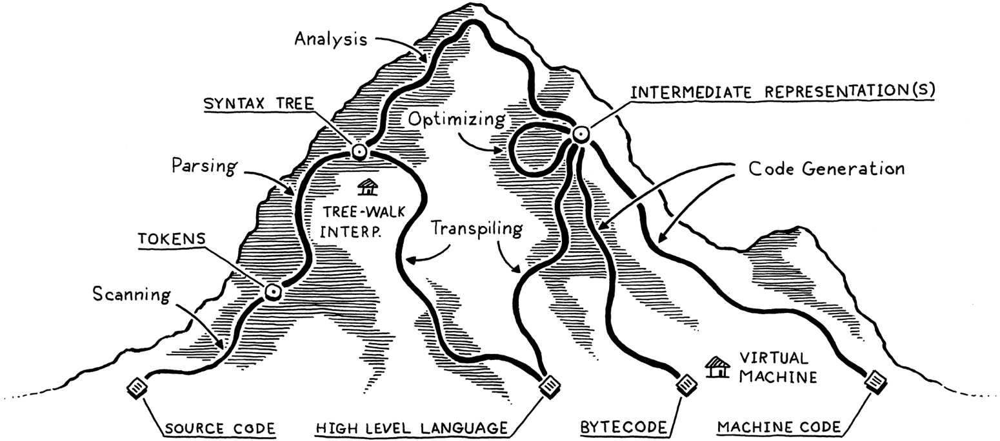

2.  A scanner (or lexer) takes in the linear stream of characters and chunks them
    together into a series of something more akin to _words_.

3.  A parser takes the flat sequence of tokens and builds a tree structure that
    mirrors the nested nature of the grammar. These trees have a couple of different
    names—_parse tree_ or _abstract syntax tree_ —depending on how close to the
    bare syntactic structure of the source language they are. In practice, language
    hackers usually call them _syntax trees_, _ASTs_, or often just _trees_.
    The parser’s job also includes letting us know when we do by reporting _syntax errors_.

4.  The language we’ll build in this book (lox) is dynamically typed, so it will do its type
    checking later, at runtime.

5.  The front end of the pipeline is specific to the source language
    the program is written in. The back end is concerned with the final architecture
    where the program will run.

6.  Intermediate representation lets you support multiple source languages and target platforms with less
    effort. Say you want to implement _Pascal_, _C_ and _Fortran_ compilers and you
    want to target _x86_, _ARM_, and, I dunno, _SPARC_. Normally, that means you’re
    signing up to write **_nine full compilers_**: Pascal→x86, C→ARM, and every other
    combination. A shared intermediate representation reduces that dramatically.
    You write one front end for each source language that produces the IR. Then one back end for
    each target architecture. Now you can mix and match those to get every
    combination.

    - Source Languages: C, Fortran, Pascal
    - Target Architectures: x86, ARM, SPARC

      ### Without Intermediate Representation (IR)

      1. **C**

         - x86
         - ARM
         - SPARC

      2. **Fortran**

         - x86
         - ARM
         - SPARC

      3. **Pascal**

         - x86
         - ARM
         - SPARC

      > 9 full compilers

      ## With Intermediate Representation (IR)

      #### Front-end

      1. **C**

         - IR

      2. **Fortran**

         - IR

      3. **Pascal**

         - IR

      #### Back-end

      4. **IR**

         - x86
         - ARM
         - SPARC

      > 3 full compilers

7.  If we generate real _machine code_, we get an executable that the OS
    can load directly onto the chip. _Native code_ is lightning fast, but generating it is
    a lot of work. Today’s architectures have piles of instructions, complex
    pipelines, and enough historical baggage to fill a 747’s luggage bay.

8.  **Execution Environments:**

    - **JVM:**
      - Executes bytecode.
    - **.Net:**
      - Uses CLR (Common Language Runtime).
      - Executes IL (Microsoft Intermediate Language).

9.  **Bytecode Compilation Options:**

    If your compiler produces bytecode, you have two primary options:

    - **Option 1: Native Code Compilation**

      - Write a mini-compiler for each target architecture.
      - Convert the bytecode to native code for the specific machine.

    - **Option 2: Virtual Machine (VM) Execution**
      - Write a virtual machine (VM) program.
      - The VM emulates a hypothetical chip supporting your virtual architecture at runtime.
      - Running bytecode in a VM is slower than translating it to native code ahead of time.
      - Offers simplicity and portability.
      - Implement the VM in a language like C, allowing the language to run on any platform with a C compiler.
      - This approach is employed by the second interpreter developed in this book.

10. If the language is run inside an interpreter or VM, then the runtime lives there. This is how most
    implementations of languages like Java, Python, and JavaScript work.

11. _Syntax-directed translation_ is a structured technique for building these all-at-once compilers. You associate an action with each piece of the grammar, usually one that generates output code. Then, whenever the parser matches that chunk of syntax, it executes the action, building up the target code one rule at a time.

12. The fastest way to execute code is by compiling it to machine code, but you might not know what architecture your end user’s machine supports. What to do?
    > You can do the same thing that the HotSpot _JVM_, _Microsoft’s CLR_ and most
        *JavaScript interpreters* do. On the end user’s machine, when the program is
        loaded—either from source in the case of JS, or platform-independent bytecode
        for the JVM and CLR—you compile it to *native* for the architecture their
        computer supports. Naturally enough, this is called *just-in-time compilation*.
        Most hackers just say "JIT".
13. Compilers and Interpreters
    - _Compiling_ is an implementation technique that involves translating a source language to some other—usually lower-level—form. When you generate bytecode or machine code, you are compiling. When you transpile to another high-level language you are compiling too.
    - When we say a language implementation _is a compiler_, we mean it translates source code to some other form but doesn’t execute it.
    - when we say an implementation “is an interpreter”, we mean it takes in source code and executes it immediately. it runs programs "from source".
14. CPython is an interpreter, and it has a compiler

### CHALLENGES

1. Pick an open source implementation of a language you like. Download the source code and poke around in it. Try to find the code that implements the scanner and parser. Are they hand-written, or generated using tools like Lex and Yacc? (.l or .y files usually imply the latter.)

2. Just-in-time compilation tends to be the fastest way to implement a dynamically typed language, but not all of them use it. What reasons are there to not JIT?

   > Complexity, Portability, and Compilation Overhead.

3. Most Lisp implementations that compile to C also contain an interpreter that lets them execute Lisp code on the fly as well. Why?

   > to provide a more interactive and flexible development environment

## Chapter 3 The Lox Language

1. Lox is dynamically typed.

2. Automatic memory management

3. There are two main techniques for managing memory: reference counting and tracing garbage collection (usually just called “garbage collection” or “GC”).

4. Data Types:

> Booleans

```c
true; // Not false.
false; // Not *not* false.
```

> Numbers: Lox only has one kind of number: double-precision floating point.

```c
1234; // An integer.
12.34; // A decimal number.

.2; // not allowed in lox
2.; // not allowed in lox
```

> Strings

```c
"I am a string";
""; // The empty string.
"123"; // This is a string, not a number.
```

> Nil

```c
return nil; // similar to returning null in other languages
```

5. Expressions:

> Arithmetic

```c
add + me;
subtract - me;
multiply * me;
divide / me;

-negateMe;
```

> Comparison and equality : 0 in lox is true not false

```c
less < than;
lessThan <= orEqual;
greater > than;
greaterThan >= orEqual;

1 == 2; // false.
"cat" != "dog"; // true.

314 == "pi"; // false.

123 == "123"; // false.
```

- look at this function in the interpreter

```java
  // the 0 in lox is true not false, if U want it be false edit the function below
  // < check-operands
  // > is-truthy
  private boolean isTruthy(Object object) {
    if (object == null)
      return false;
    if (object instanceof Boolean)
      return (boolean) object;
    return true;
  }
```

> Logical operators : The reason and and or are like control flow structures is because they short circuit. Not only does and return the left operand if it is false, it doesn’t even evaluate the right one in that case.

```c
!true; // false.
!false; // true.

true and false; // false.
true and true; // true.

false or false; // false.
true or false; // true.
```

> Precedence and grouping

```js
var average = (min + max) / 2;
```

6. Statements

```c
print "Hello, world!";

"some expression";

{
print "One statement.";
print "Two statements.";
}
```

7. Variables

```js
var imAVariable = "here is my value";
var iAmNil;

var breakfast = "bagels";
print breakfast; // "bagels".
breakfast = "beignets";
print breakfast; // "beignets".
```

8. Control Flow

```js
if (condition) {
print "yes";
} else {
print "no";
}

var a = 1;
while (a < 10) {
print a;
a = a + 1;
}

for (var a = 1; a < 10; a = a + 1) {
print a;
}
```

9. Functions

- An _argument_ is an actual value you pass to a function when you call it.

- A _parameter_ is a variable that holds the value of the argument inside the body of the function.

```c
makeBreakfast(bacon, eggs, toast);

makeBreakfast();

// a and b called parameters
fun printSum(a, b) {
    print a + b;
}

// 1 and 2 called arguments
printSum(1,2);
```

> Closures

```js
fun addPair(a, b) {
return a + b;
}

fun identity(a) {
return a;
}
print identity(addPair)(1, 2); // Prints "3".

fun outerFunction() {
    fun localFunction() {
        print "I'm local!";
    }
    localFunction();
}

fun returnFunction() {
    var outside = "outside";
    fun inner() {
    print outside;
    }
    return inner;
}
var fn = returnFunction();
fn();
```

10. Classes

```c
class Breakfast {
    // var x = 5; // this is not allowed in lox
    cook() {
        print "Eggs a-fryin'!";
    }
    serve(who) {
        print "Enjoy your breakfast, " + who + ".";
    }
}

// Store it in variables.
var someVariable = Breakfast;
// Pass it to functions.
someFunction(Breakfast);

var breakfast = Breakfast();
print breakfast; // "Breakfast instance".
```

> Inheritance: using a less-than (<) operator

```c
class Brunch < Breakfast {
    drink() {
        print "How about a Bloody Mary?";
    }
}

var benedict = Brunch("ham", "English muffin");
benedict.serve("Noble Reader");

class Brunch < Breakfast {
    init(meat, bread, drink) {
        super.init(meat, bread);
        this.drink = drink;
    }
}
```

> The Standard Library : built-in function clock() that returns the number of seconds since the program started.

### CHALLENGES

1. Write some sample Lox programs and run them (you can use the implementations of Lox in my repository). Try to come up with edge case behavior I didn’t specify here. Does it do what you expect? Why or why not?

```js
/*
fun makeCounter() {
  var i = 0;
  fun count() {
    i = i + 1;
    print i;
  }

  return count;
}

//fun scope(a) {
//  print a; // parameter
//  var a = "local";
//  print a; // local
//}

fun thrice(fn) {
  for (var i = 1; i <= 3; i = i + 1) {
    fn(i);
  }
}

thrice(fun (a) {
  print a;
});
// "1".
// "2".
// "3".

var counter = makeCounter();
//counter(); // "1".
//counter(); // "2".

//scope("parameter");

fun scope(a) {
  print a;
  var a = "local";
  print a;
}

print 10;
scope(5);

/*

/*
var a = "global";
{
  fun showA() {
    print a;
  }

  showA();
  var a = "block";
  showA();
  {
    var a = "block2";
    showA();
  }
  showA();
}
*/

/*
var a = 5;

{
  print a;
  var a = a;
  print a;
  a = 6;
  print a;
}
*/


/*
var a = 5;
var a = 6;
print a;
*/


/*
fun bad() {
var a = "first";
var a = "second";
print a;
}

bad();
*/

//break;

/*
while (true) {
  if (5 > 0 ) {
    print 6;
    break;
  }
  var a = 6;
  print a;
}
var a = 5;
print a;
*/

/*
while (true) {
  var a = 6;
  print a;

  if (5 > 0) {
    break;
  }
}

var a = 5;
print a;
*/

/*
if (a > 1) {
  print a;
  break;
}
*/

/*
class DevonshireCream {
  serveOn() {
    return "Scones";
  }
}
print DevonshireCream; // Prints "DevonshireCream".

class Bagel {}
var bagel = Bagel();
print bagel; // Prints "Bagel instance".

class Bacon {
  eat() {
    print "Crunch crunch crunch!";
  }
}

Bacon().eat(); // Prints "Crunch crunch crunch!".
*/

/*
class Doughnut {
  cook() {
    print "Fry until golden brown.";
  }
}
class BostonCream < Doughnut {
  cook() {
    var method = super.cook;
    method();
    super.cook();
    print "Pipe full of custard and coat with chocolate.";
  }
}
BostonCream().cook();
*/

/*
class A {
  method() {
  print "Method A";
  }
}
class B < A {
  method() {
    print "Method B";
  }
  test() {
    super.method();
  }
}
class C < B {}

C().test();
*/

/*
fun fib(n) {
  if (n < 2) return n;
  return fib(n - 1) + fib(n - 2);
}

var before = clock();
print fib(40);
var after = clock();
print after - before;
*/

while (true) {
  if (5 > 0 ) {
    print 6;
    break;
  }
}
```

2. This informal introduction leaves a lot unspecified. List several open questions you have about the language’s syntax and semantics. What do you think the answers should be?

3. Lox is a pretty tiny language. What features do you think it is missing that would make it annoying to use for real programs? (Aside from the standard library, of course.)

## Chapter 4 Scanning

1. The scanner takes in raw source code as a series of characters and groups it into a series of chunks we call tokens.

2. Lox is a scripting -high level- language, which means it executes directly from source.

3. Each of these blobs of characters is called a lexeme:


4. Note that the ! and = are not two independent operators. You can’t write ! = in Lox and have it behave like an inequality operator.

5. We’ve got another helper:

```java
private char peek() {
  if (isAtEnd()) return '\0';
  return source.charAt(current);
}
```

> It’s sort of like advance(), but doesn’t consume the character. This is called **_lookahead_**. Since it only looks at the current unconsumed character, we have one character of lookahead. **_The smaller this number is, generally, the faster the scanner runs._** The rules of the lexical grammar dictate how much lookahead we need. Fortunately, most languages in wide use only peek one or two characters ahead.

#### Mid Qs : What is the lookahead of the scanner ? is it better to have larger or smaller lookaheads ? What is the lookahead of Lox ?

- Lookahead in Scanners:

Meaning: The lookahead of a scanner refers to the number of characters it can examine ahead of its current position without actually consuming them. It aids in making informed decisions about token formation.
`peek()` and `peekNext()` are lookaheads of the scanner

- Optimal Size:

Smaller lookaheads (1-2 characters) are generally preferred for efficiency.
Larger lookaheads might be necessary for certain language constructs but can impact speed.

- Lox's Lookahead

Lox's scanner uses a lookahead of 1 character. This is sufficient for its lexical grammar, as it doesn't have complex constructs that require extensive lookahead.

6. Since we only look for a digit to start a number, that means -123 is not a number literal. Instead, -123, is an expression that applies - to the number literal 123.

```js
print -123.abs();
```

> This prints -123 because negation has lower precedence than method calls. We could fix that by making - part of the number literal. But then consider:

```js
var n = 123;
print - n.abs();
```

> This still produces -123, so now the language seems inconsistent. No matter what you do, some case ends up weird.

7. We don’t allow a leading or trailing decimal point, so these are both invalid:

```c
.1234
1234.
```

8. We don't allow this :

```js
123.sqrt();
```

9. Consider this in lox:

```js
var a = 5;

print -a; // -5
print --a; // 5
print ---a; // -5
```

10. ```java
    case 'o':
      if (peek() == 'r') {
        addToken(OR);
      }
    break;
    ```

Consider what would happen if a user named a variable _orchid_. The scanner would see the first two letters, or, and immediately emit an or keyword token. This gets us to an important principle called **_maximal munch_**. _When two lexical grammar rules can both match a chunk of code that the scanner is looking at, whichever one matches the most characters wins._

11. Maximal munch means we can’t easily detect a reserved word until we’ve reached the end of what might instead be an identifier.

### CHALLENGES

1. The lexical grammars of Python and Haskell are not regular. What does that mean, and why aren’t they?

   > A lexical grammar defines the basic building blocks of a programming language, such as tokens (keywords, identifiers, literals, etc.), and specifies how these tokens are combined to form valid programs. The reason why the lexical grammars of Python and Haskell are not regular can be attributed to the expressive power and flexibility that these languages provide.

2. Aside from separating tokens—distinguishing print foo from printfoo — spaces aren’t used for much in most languages. However, in a couple of dark corners, a space does affect how code is parsed in CoffeeScript, Ruby, and the C preprocessor. Where and what effect does it have in each of those languages?

3. Our scanner here, like most, discards comments and whitespace since those aren’t needed by the parser. Why might you want to write a scanner that does not discard those? What would it be useful for?

4. Add support to Lox’s scanner for C-style /\*..... \*/ block comments. Make sure to handle newlines in them. Consider allowing them to nest. Is adding support for nesting more work than you expected? Why?

- Scanner.java

```java
case '/':
				if (match('/')) {
					// A comment goes until the end of the line.
					while (peek() != '\n' && !isAtEnd())
						advance();
				} else if (match('*')) {
					MultilineComment();
				} else {
					addToken(SLASH);
				}
				break;
```

```java
	private void MultilineComment() {

		int nestLevel = 1;

		while (true) {
			if (isAtEnd()) {
				Lox.error(line, "Unterminated multiline comment.");
				return;
			}

			if (peek() == '/' && peekNext() == '*') {
				// Consume the '*' and '/' characters.
				advance();
				advance();
				nestLevel++;
				return;
			} else if (peek() == '*' && peekNext() == '/') {
				advance();
				advance();
				nestLevel--;

				if (nestLevel == 0) {
					return;

				}
			} else if (peek() == '\n') {
				line++;
			}

			advance();
		}
	}
```

## Visitor Design Pattern


## Chapter 5 Representing Code

1. If you start with the rules, you can use them to generate strings that are in the grammar. Strings created this way are called derivations because each is "derived" from the rules of the grammar.

2. Rules are called productions because they produce strings in the grammar.

3. A terminal is a letter from the grammar’s alphabet.

4. A nonterminal is a named reference to another rule in the grammar.

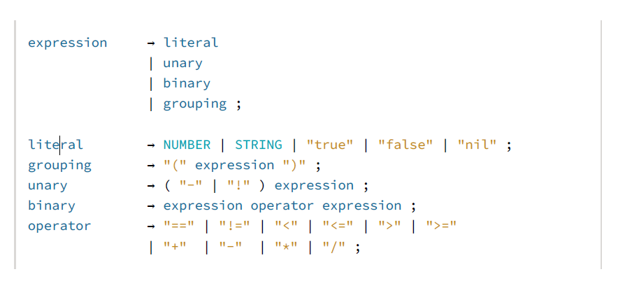

5. To perform an operation on a pastry, we call its accept() method and pass in the visitor for the operation we want to execute. The pastry—the specific subclass’s overriding implementation of accept()—turns around and calls the appropriate visit method on the visitor and passes itself to it. That’s the heart of the trick right there.**_ It lets us use polymorphic dispatch on the pastry classes to select the appropriate method on the visitor class._**

### CHALLENGES

1. Earlier, I said that the |, \*, and + forms we added to our grammar metasyntax were just syntactic sugar. Given this grammar:

   > expr → expr ( "(" ( expr ( "," expr )\* )? ")" | "." IDENTIFIER )+ | IDENTIFIER | NUMBER

Produce a grammar that matches the same language but does not use any of that notational sugar.
Bonus: What kind of expression does this bit of grammar encode?

2. The Visitor pattern lets you emulate the functional style in an object-oriented language. Devise a complementary pattern for a functional language. It should let you bundle all of the operations on one type together and let you define new types easily. (SML or Haskell would be ideal for this exercise, but Scheme or another Lisp works as well.)

3. In Reverse Polish Notation (RPN), the operands to an arithmetic operator are both placed before the operator, so 1 + 2 becomes 1 2 +. Evaluation proceeds from left to right. Numbers are pushed onto an implicit stack. An arithmetic operator pops the top two numbers, performs the operation, and pushes the result. Thus, this:

```c
(1 + 2) * (4 - 3)
```

in RPN becomes:

```c
1 2 + 4 3 - *
```

Define a visitor class for our syntax tree classes that takes an expression, converts it
to RPN, and returns the resulting string.

> change the visitBinaryExpr function in AstPrinter.java from this one :

```java
  @Override
  public String visitBinaryExpr(Expr.Binary expr) {
    return parenthesize(expr.operator.lexeme,
        expr.left, expr.right);
  }

    private String parenthesize(String name, Expr... exprs) {
    StringBuilder builder = new StringBuilder();

    builder.append("(").append(name);
    for (Expr expr : exprs) {
      builder.append(" ");
      builder.append(expr.accept(this));
    }
    builder.append(")");

    return builder.toString();
  }
```

> to this one :

```java
     @Override

    public String visitBinaryExpr(Expr.Binary expr) {
        String left = expr.left.accept(this);
        String right = expr.right.accept(this);
        return left + " " + right + " " + expr.operator.lexeme;
    }
```

## Chapter 6 Parsing Expressions

1. Precedence determines which operator is evaluated first in an expression containing a mixture of different operators. Precedence rules tell us that we evaluate the / before the -. Operators with higher precedence are evaluated before operators with lower precedence. Equivalently, higher precedence operators are said to "bind tighter".

2. Associativity determines which operator is evaluated first in a series of the same operator. When an operator is left-associative (think “left-to-right”), operators on the left evaluate before those on the right. Since - is left associative, this expression:

```c
5 - 3 - 1
```

is equivalent to:

```c
(5 - 3) - 1
```

Assignment, on the other hand, is _right-associative_. This:

```c
a = b = c
```

is equivalent to:

```c
a = (b = c)
```

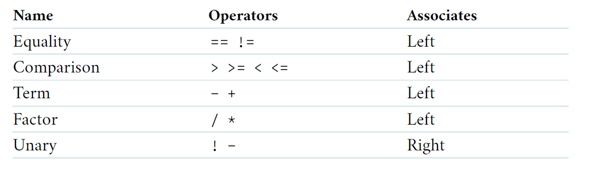

We fix that by stratifying the grammar. We define a separate rule for each
precedence level.

```c
expression → ...
equality → ...
comparison → ...
term → ...
factor → ...
unary → ...
primary → ...
```

left-recursive problem:

```c
factor → factor ( "/" | "*" ) unary | unary ;
```

This rule is correct, but not optimal for how we
intend to parse it. Instead of a left recursive rule, we’ll use a different one.

```c
factor → unary ( ( "/" | "*" ) unary )* ;
```

3. New Grammar:

```c
expression → equality ;
equality → comparison ( ( "!=" | "==" ) comparison )* ;
comparison → term ( ( ">" | ">=" | "<" | "<=" ) term )* ;
term → factor ( ( "-" | "+" ) factor )* ;
factor → unary ( ( "/" | "*" ) unary )* ;
unary → ( "!" | "-" ) unary | primary ;
primary → NUMBER | STRING | "true" | "false" | "nil" | "(" expression ")" ;
```

This grammar is more complex than the one we had before, but in return we
have eliminated the previous one’s ambiguity. It’s just what we need to make a
parser.

4. What parsing algorithm is used for Lox ?

   > Recursive Descent, It’s called “recursive descent” because it walks down the grammar.

5. In a top-down parser, you reach the lowest-precedence expressions first because they may in turn contain subexpressions of higher precedence.

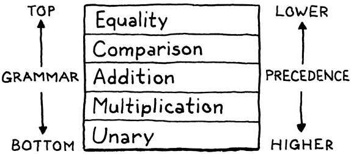

6. Recursive descent is the simplest way to build a parser, and doesn’t require using complex parser generator tools like Yacc, Bison or ANTLR.

7. Recursive descent parsers are fast, robust, and can support sophisticated errorhandling. In fact, GCC, V8 (the JavaScript VM in Chrome), Roslyn (the C# compiler written in C#) and many other heavyweight production language implementations use recursive descent.

8. Recursive descent is considered a top-down parser because it starts from the top or outermost grammar rule (here expression) and works its way down into the nested subexpressions before finally reaching the leaves of the syntax tree. This is in contrast with bottom-up parsers like LR that start with primary expressions and compose them into larger and larger chunks of syntax.

9. A recursive descent parser is a literal translation of the grammar’s rules straight
   into imperative code. Each rule becomes a function.

10. The “recursive” part of recursive descent is because when a grammar rule refers to itself—directly or indirectly—that translates to a recursive function call.

11. A parser really has two jobs:

    1. Given a valid sequence of tokens, produce a corresponding syntax tree.
    2. Given an invalid sequence of tokens, detect any errors and tell the user about their mistakes.

12. There are a couple of hard requirements for when the parser runs into a syntax error:

    1. It must detect and report the error. If it doesn’t detect the error and passes the resulting malformed syntax tree on to the interpreter, all manner of horrors may be summoned.
    2. It must not crash or hang. Syntax errors are a fact of life and language tools have to be robust in the face of them. Segfaulting or getting stuck in an infinite loop isn’t allowed. While the source may not be valid code, it’s still a valid input to the parser because users use the parser to learn what syntax is allowed.

13. A decent parser should:

    1. Be fast.
    2. Report as many distinct errors as there are.
    3. Minimize cascaded errors.

14. Of all the recovery techniques devised in yesteryear, the one that best stood the test of time is called—somewhat alarmingly—panic mode. As soon as the parser detects an error, it enters panic mode. It knows at least one token doesn’t make sense given its current state in the middle of some stack of grammar productions.
    Before it can get back to parsing, it needs to get its state and the sequence of
    forthcoming tokens aligned such that the next token does match the rule being
    parsed. This process is called **synchronization**.
    To do that, we select some rule in the grammar that will mark the synchronization point. The parser fixes its parsing state by jumping out of any nested productions until it gets back to that rule. Then it synchronizes the token stream by discarding tokens until it reaches one that can appear at that point in the rule.

### CHALLENGES

1. In C, a block is a statement form that allows you to pack a series of statements where a single one is expected. The comma operator is an analogous syntax for expressions. A comma-separated series of expressions can be given where a single expression is expected (except inside a function call’s argument list). At runtime, the comma operator evaluates the left operand and discards the result. Then it evaluates and returns the right operand. Add support for comma expressions. Give them the same precedence and associativity as in C. Write the grammar, and then implement the necessary parsing code.

> Grammar for Comma Expressions:

```c
expression -> equality ;
equality -> comma ;
comma -> comparison ( "," comparison ) ;
```

```java
  private Expr comma() {
    Expr expr = comparison();

    while (match(COMMA)) {
      Token operator = previous();
      Expr right = comparison();
      expr = new Expr.Binary(expr, operator, right);
    }

    return expr;
  }

```

2. Likewise, add support for the C-style conditional or “ternary” operator ?:. What precedence level is allowed between the ? and :? Is the whole operator left associative or right-associative?

> Grammar for Ternary Operator:

```c
expression -> conditional ;
conditional -> equality ;
```

> add this class to GenerateAst :
> "Conditional : Expr condition, Expr thenBranch, Expr elseBranch"

> add this function to AstPrinter

```java
  @Override
  public String visitConditionalExpr(Expr.Conditional expr) {
    return parenthesize2("?", expr.condition, ":", expr.thenBranch, expr.elseBranch);
  }
```

> update the scanner and the need operators

> in Parser.java

```java
  private Expr conditional() {
    Expr expr = equality();

    if (match(QUESTION)) {
      Expr thenBranch = expression();
      consume(COLON, "Expect ':' after 'then' branch in conditional expression.");
      Expr elseBranch = conditional();
      expr = new Expr.Conditional(expr, thenBranch, elseBranch);
    }

    return expr;
  }
```

3. Add error productions to handle each binary operator appearing without a left hand operand. In other words, detect a binary operator appearing at the beginning of an expression. Report that as an error, but also parse and discard a right-hand operand with the appropriate precedence.

## Chapter 7 Evaluating Expressions

1. In Lox, values are created by literals, computed by expressions, and stored in variables.

2. A literal is a bit of syntax that produces a value. A literal always appears somewhere in the user’s source code. Lots of values are produced by computation and don’t exist anywhere in the code itself. Those aren’t literals. A literal comes from the parser’s domain. Values are an interpreter concept, part of the runtime’s world.

3. We can’t evaluate the unary operator itself until after we evaluate its operand subexpression. That means our interpreter is doing a post-order traversal—each node evaluates its children before doing its own work.

4. Lox follows Ruby’s simple rule: false and nil are falsey and everything else is truthy.

5. Runtime errors are failures that the language semantics demand we detect and report while the program is running (hence the name).

### CHALLENGES

1. Allowing comparisons on types other than numbers could be useful. The operators might have a reasonable interpretation for strings. Even comparisons among mixed types, like 3 < "pancake" could be handy to enable things like ordered collections of heterogeneous types. Or it could simply lead to bugs and confusion. Would you extend Lox to support comparing other types? If so, which pairs of types do you allow and how do you define their ordering? Justify your choices and compare them to other languages.

2. Many languages define + such that if either operand is a string, the other is converted to a string and the results are then concatenated. For example, "scone" + 4 would yield scone4. Extend the code in visitBinaryExpr() to support that.

> edit visitBinaryExpr() function in Interpreter.java

```java
// < Statements and State visit-assign
  // > visit-binary
  @Override
  public Object visitBinaryExpr(Expr.Binary expr) {
    Object left = evaluate(expr.left);
    Object right = evaluate(expr.right); // [left]

    switch (expr.operator.type) {
      case GREATER:
        // checkNumberOperands(expr.operator, left, right);
        // accept compare number with the length of string
        if (left instanceof Double && right instanceof Double)
          return (double) left > (double) right;
        if (left instanceof Double && right instanceof String)
          return (double) left > right.toString().length();
        if (left instanceof String && right instanceof Double)
          return left.toString().length() > (double) right;
        break;
      case GREATER_EQUAL:
        // checkNumberOperands(expr.operator, left, right);
        // accept compare number with the length of string
        if (left instanceof Double && right instanceof Double)
          return (double) left >= (double) right;
        if (left instanceof Double && right instanceof String)
          return (double) left >= right.toString().length();
        if (left instanceof String && right instanceof Double)
          return left.toString().length() >= (double) right;
        break;
      case LESS:
        // checkNumberOperands(expr.operator, left, right);
        // accept compare number with the length of string
        if (left instanceof Double && right instanceof Double)
          return (double) left < (double) right;
        if (left instanceof Double && right instanceof String)
          return (double) left < right.toString().length();
        if (left instanceof String && right instanceof Double)
          return left.toString().length() < (double) right;
        break;
      case LESS_EQUAL:
        // checkNumberOperands(expr.operator, left, right);
        // accept compare number with the length of string
        if (left instanceof Double && right instanceof Double)
          return (double) left <= (double) right;
        if (left instanceof Double && right instanceof String)
          return (double) left <= right.toString().length();
        if (left instanceof String && right instanceof Double)
          return left.toString().length() <= (double) right;
        break;
      case BANG_EQUAL:
        return !isEqual(left, right);
      case EQUAL_EQUAL:
        return isEqual(left, right);
      case MINUS:
        checkNumberOperands(expr.operator, left, right);
        return (double) left - (double) right;
      case PLUS:
        if (left instanceof Double && right instanceof Double) {
          return (double) left + (double) right;
        }
        if (left instanceof String && right instanceof String) {
          return (String) left + (String) right;
        }
        // make the lox accept add strings with numbers
        if (left instanceof Double && right instanceof String) {
          return stringify((Double) left) + (String) right;
        }
        if (left instanceof String && right instanceof Double) {
          return (String) left + stringify((Double) right);
        }
        break;
      // throw new RuntimeError(expr.operator,
      // "Operands must be two numbers or two strings.");
      case SLASH:
        checkNumberOperands(expr.operator, left, right);
        // handel our own messages on not allowed divisions
        Object result = (double) left / (double) right;
        if (result.toString() == "Infinity")
          return "Division by zero is not allowed";
        if (result.toString() == "NaN")
          return "Not a Number";
        return result;
      case STAR:
        // checkNumberOperands(expr.operator, left, right);
        // return (double) left * (double) right;
        if (left instanceof Double && right instanceof Double) {
          return (double) left * (double) right;
        }

        if (left instanceof Double && right instanceof String) {
          double repeatCount = (Double) left;
          if (repeatCount < 0) {
            throw new RuntimeError(null,
                "Cannot repeat a string a negative number of times");
          }
          StringBuilder starResult = new StringBuilder();
          for (int i = 0; i < repeatCount; i++) {
            starResult.append(right);
          }
          return starResult.toString();
        }
    }
  }
```

3. What happens right now if you divide a number by zero? What do you think should happen? Justify your choice. How do other languages you know handle division by zero and why do they make the choices they do? Change the implementation in visitBinaryExpr() to detect and report a runtime error for this case.

> like java and we can change this message in stringify() function

```java
print 5 /0; // Infinity
print 0/0; // NaN
print 0/5; // 0
```

## Chapter 8 Statements and State

1. New syntax means new grammar rules. In this chapter, we finally gain the ability to parse an entire Lox script. Since Lox is an imperative, dynamically typed language, the “top level” of a script is simply a list of statements. The new rules are:

```c
program → statement* EOF ;
statement → exprStmt | printStmt ;
exprStmt → expression ";" ;
printStmt → "print" expression ";" ;
```

2. To accommodate the distinction, we add another rule for kinds of statements that declare names.

```c
program → declaration* EOF ;
declaration → varDecl | statement ;
statement → exprStmt | printStmt ;
exprStmt → expression ";" ;
printStmt → "print" expression ";" ;
```

3. The rule for declaring a variable looks like:

```c
varDecl → "var" IDENTIFIER ( "=" expression )? ";" ;
```

4. New Grammar:

```c
expression → equality ;
equality → comparison ( ( "!=" | "==" ) comparison )* ;
comparison → term ( ( ">" | ">=" | "<" | "<=" ) term )* ;
term → factor ( ( "-" | "+" ) factor )* ;
factor → unary ( ( "/" | "*" ) unary )* ;
unary → ( "!" | "-" ) unary | primary ;
primary → "true" | "false" | "nil" | NUMBER | STRING | "(" expression ")" | IDENTIFIER ;
```

5. Assignment syntax: assignment is an expression and not a statement

```c
expression → assignment ;
assignment → IDENTIFIER "=" assignment | equality ;
equality → comparison ( ( "!=" | "==" ) comparison )* ;
comparison → term ( ( ">" | ">=" | "<" | "<=" ) term )* ;
term → factor ( ( "-" | "+" ) factor )* ;
factor → unary ( ( "/" | "*" ) unary )* ;
unary → ( "!" | "-" ) unary | primary ;
primary → "true" | "false" | "nil" | NUMBER | STRING | "(" expression ")" | IDENTIFIER ;
```

6. A single token lookahead recursive descent parser can’t see far enough to tell that it’s parsing an assignment until after it has gone through the left-hand side and stumbled onto the =. The difference is that the left-hand side of an assignment isn’t an expression that evaluates to a value. It’s a sort of pseudo-expression that evaluates to a “thing” you can assign to. In:

```js
var a = "before";
a = "value";
```

7. The trick is that right before we create the assignment expression node, we look at the left-hand side expression and figure out what kind of assignment target it is. We convert the r-value expression node into an l-value representation.

8. The last thing the visit() method does is return the assigned value. That’s because assignment is an expression that can be nested inside other expressions, like so:

```js
var a = 1; // statement
print a = 2; // "2". expression
```

9. Lexical scope (or the less commonly heard static scope) is a specific style of scoping where the text of the program itself shows where a scope begins and ends.

10. This is in contrast with dynamic scope where you don’t know what a name refers to until you execute the code. **Lox doesn’t have dynamically scoped variables, but methods and fields on objects are dynamically scoped.**

11. Look at the block where we calculate the volume of the cuboid using a local declaration of volume. After the block exits, the interpreter will delete the global volume variable. That ain’t right. When we exit the block, we should remove any variables declared inside the block, but if there is a variable with the same name declared outside of the block, that’s a different variable. It doesn’t get touched.
    When a local variable has the same name as a variable in an enclosing scope, it **shadows** the outer one. Code inside the block can’t see it any more—it is hidden in the “shadow” cast by the inner one—but it’s still there.

12. When we enter a new block scope, we need to preserve variables defined in outer scopes so they are still around when we exit the inner block. We do that by defining a fresh environment for each block containing only the variables defined in that scope. When we exit the block, we discard its environment and restore the previous one.
    We also need to handle enclosing variables that are not shadowed.

```js
var global = "outside";
{
var local = "inside";
print global + " " + local; // outside inside
}
```

The interpreter must search not only the current innermost environment, but also any enclosing ones.

13. Block syntax and semantics:

```c
program → declaration* EOF ;
declaration → varDecl | statement ;
statement → exprStmt | printStmt | block ;
block → "{" declaration* "}" ;
exprStmt → expression ";" ;
printStmt → "print" expression ";" ;
```

A block is a (possibly empty) series of statements or declarations surrounded by curly braces. A block is itself a statement and can appear anywhere a statement is allowed. It contains the list of statements that are inside the block. Parsing is straightforward.

## Chapter 9 Control Flow

1. Lox doesn’t have a conditional operator, so let’s get our if statement on. Our statement grammar gets a new production.

```c
program → declaration* EOF ;
declaration → varDecl | statement ;
statement → exprStmt | ifStmt | printStmt | block ;
ifStmt → "if" "(" expression ")" statement ( "else" statement )? ;
block → "{" declaration* "}" ;
exprStmt → expression ";" ;
printStmt → "print" expression ";" ;
```

2. Since else clauses are optional, and there is no explicit delimiter marking the end of the if statement, the grammar is ambiguous when you nest ifs in this way. This classic pitfall of syntax is called the **dangling else** problem.


It is possible to define a context-free grammar that avoids the ambiguity
directly, but it requires splitting most of the statement rules into pairs, one that
allows an if with an else and one that doesn’t. It’s annoying.

Instead, most languages and parsers avoid the problem in an ad hoc way. No
matter what hack they use to get themselves out of the trouble, they always
choose the same interpretation— **the else is bound to the nearest if that precedes it.**Our parser conveniently does that already.

3. Logical Operators : These aren’t like other binary operators because they **short-circuit**.

4. The two new operators (or , and) are low in the precedence table. Similar to || and && in C, they each have their own precedence with or lower than and. We slot them right between assignment and equality.

```c
expression → assignment ;
assignment → IDENTIFIER "=" assignment | logic_or ;
logic_or → logic_and ( "or" logic_and )* ;
logic_and → equality ( "and" equality )* ;
equality → comparison ( ( "!=" | "==" ) comparison )* ;
comparison → term ( ( ">" | ">=" | "<" | "<=" ) term )* ;
term → factor ( ( "-" | "+" ) factor )* ;
factor → unary ( ( "/" | "*" ) unary )* ;
unary → ( "!" | "-" ) unary | primary ;
primary → "true" | "false" | "nil" | NUMBER | STRING | "(" expression ")" | IDENTIFIER ;
```

5. While Loops

```c
program → declaration* EOF ;
declaration → varDecl | statement ;
statement → exprStmt | ifStmt | printStmt | whileStmt | block ;
whileStmt → "while" "(" expression ")" statement ;
ifStmt → "if" "(" expression ")" statement ( "else" statement )? ;
block → "{" declaration* "}" ;
exprStmt → expression ";" ;
printStmt → "print" expression ";" ;
```

6. For Loops

```c
program → declaration* EOF ;
declaration → varDecl | statement ;
statement → exprStmt | forStmt | ifStmt | printStmt | whileStmt | block ;
forStmt → "for" "(" ( varDecl | exprStmt | ";" ) expression? ";" expression? ")" statement ;
whileStmt → "while" "(" expression ")" statement ;
ifStmt → "if" "(" expression ")" statement ( "else" statement )? ;
block → "{" declaration* "}" ;
exprStmt → expression ";" ;
printStmt → "print" expression ";" ;
```

## Chapter 10 Functions

1. The thing being called—the callee—can be any expression that evaluates to a function. You can think of a call as sort of like a postfix operator that starts with (. This “operator” has higher precedence than any other operator, even the unary ones. So we slot it into the grammar by having the unary rule bubble up to a new call rule.

```c
expression → assignment ;
assignment → IDENTIFIER "=" assignment | logic_or ;
logic_or → logic_and ( "or" logic_and )* ;
logic_and → equality ( "and" equality )* ;
equality → comparison ( ( "!=" | "==" ) comparison )* ;
comparison → term ( ( ">" | ">=" | "<" | "<=" ) term )* ;
term → factor ( ( "-" | "+" ) factor )* ;
factor → unary ( ( "/" | "*" ) unary )* ;
unary → ( "!" | "-" ) unary | call ;
call → primary ( "(" arguments? ")" )* ;
arguments → expression ( "," expression )* ;
primary → "true" | "false" | "nil" | NUMBER | STRING | "(" expression ")" | IDENTIFIER ;
```

This rule matches a primary expression followed by zero or more function calls. If there are no parentheses, this parses a bare primary expression. Otherwise, each call is recognized by a pair of parentheses with an optional list of arguments inside.

**This rule requires at least one argument expression, followed by zero or more other expressions, each preceded by a comma. To handle zero-argument calls, the call rule itself considers the entire arguments production to be optional.**

2. The C standard says a conforming implementation has to support at least 127 arguments to a function, but doesn’t say there’s any upper limit. The Java specification says a method can accept no more than 255 arguments.
   Our Java interpreter for Lox doesn’t really need a limit, but having a maximum number of arguments will simplify our bytecode interpreter in Part III, so we’ll add the same limit (>= 255) to jlox.

   lox/Parser.java
   in finishCall()

   ```java
   do {
   if (arguments.size() >= 255) {
      error(peek(), "Can't have more than 255 arguments.");
    }
   arguments.add(expression());
   ```

   **Note that** the code here reports an error if it encounters too many arguments,
   but it doesn’t throw the error. Throwing is how we kick into panic mode which
   is what we want if the parser is in a confused state and doesn’t know where it is
   in the grammar anymore. But here, the parser is still in a perfectly valid state—
   it just found too many arguments. So it reports the error and keeps on keepin’ on.

3. Function Declarations

```c
program → declaration* EOF ;
declaration → funDecl | varDecl | statement ;
funDecl → "fun" function ;
function → IDENTIFIER "(" parameters? ")" block ;
parameters → IDENTIFIER ( "," IDENTIFIER )* ;
statement → exprStmt | forStmt | ifStmt | printStmt | whileStmt | block ;
forStmt → "for" "(" ( varDecl | exprStmt | ";" ) expression? ";" expression? ")" statement ;
whileStmt → "while" "(" expression ")" statement ;
ifStmt → "if" "(" expression ")" statement ( "else" statement )? ;
block → "{" declaration* "}" ;
exprStmt → expression ";" ;
printStmt → "print" expression ";" ;
```

4.  Core to functions are the idea of parameters, and that a function encapsulates those parameters—no other code outside of the function can see them. This means **each function gets its own environment** where it stores those variables. Further, this environment must be created dynamically. Each function call gets its own environment. Otherwise, recursion would break. If there are multiple calls to the same function in play at the same time, each needs its own environment, even though they are all calls to the same function.

5.  That’s why we create a new environment at each call, not at the function declaration. The call() method we saw earlier does that. At the beginning of the call, it creates a new environment. Then it walks the parameter and argument lists in lockstep. For each pair, it creates a new variable with the parameter’s name and binds it to the argument’s value.

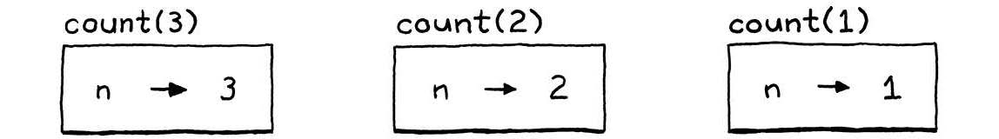

6.  Return Statements

```c
program → declaration* EOF ;
declaration → funDecl | varDecl | statement ;
funDecl → "fun" function ;
function → IDENTIFIER "(" parameters? ")" block ;
parameters → IDENTIFIER ( "," IDENTIFIER )* ;
statement → exprStmt | forStmt | ifStmt | printStmt | returnStmt | whileStmt | block ;
returnStmt → "return" expression? ";" ;
forStmt → "for" "(" ( varDecl | exprStmt | ";" ) expression? ";" expression? ")" statement ;
whileStmt → "while" "(" expression ")" statement ;
ifStmt → "if" "(" expression ")" statement ( "else" statement )? ;
block → "{" declaration* "}" ;
exprStmt → expression ";" ;
printStmt → "print" expression ";" ;
```

7. Check this lox code:

```js
fun procedure() {
  print "don't return anything";
}
var result = procedure(); // don't return anything
print result; // nil
```

This means every Lox function must return something, even if it contains no return statements at all. We use nil for this, which is why LoxFunction’s implementation of call() returns null at the end.

8. To make the count() read i we implement the closure. This data structure is called a “closure” because it “closes over” and holds onto the surrounding variables where the function is declared.

```js
fun makeCounter() {
  var i = 0;
  fun count() {
    i = i + 1;
    print i;
  }
  return count;
}
var counter = makeCounter();
counter(); // "1".
counter(); // "2".
```

## Chapter 11: Resolving and Binding

1. Without the Resolver:

Prior to implementing the resolver, the given code exhibits a notable issue. When the `showA()` function is invoked inside a block, it surprisingly behaves like dynamic scoping despite our intention of having static scoping. The root cause of this unexpected behavior lies in the closure mechanism introduced in the preceding chapter.

Consider the following problematic code snippet:

```js
var a = "global";
{
  fun showA() {
    print a;
  }
  showA(); // Prints "global"
  var a = "block";
  showA(); // Prints "block"
}
```

In the second invocation of `showA()`, it displays "block" instead of adhering to the expected static scoping, which is a deviation caused by the closure.

2. With the Resolver:

After incorporating the resolver, the `showA()` function now consistently adheres to static scoping. The resolver ensures that the function references the global variable `a` regardless of the surrounding block's variable declaration.

Consider the improved code snippet:

```js
var a = "global";
{
  fun showA() {
    print a;
  }
  showA(); // Prints "global"
  var a = "block";
  showA(); // Prints "global"
}
```

With the resolver in place, the second invocation of `showA()` consistently outputs "global," addressing the scoping issue observed in the previous version of the code.

3. Let's explain what is happening by our interpreter:

   1. First, we have a global variable 'a'

      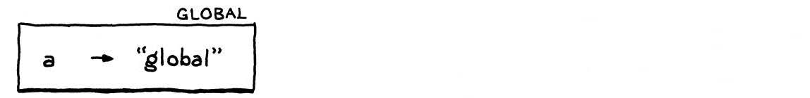

   2. We enter the block and execute the declaration of `showA()`

      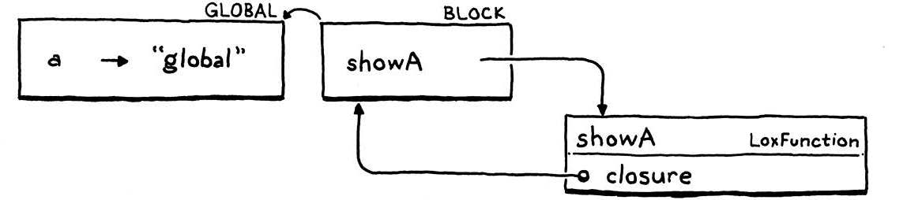

      - We get a new environment for the block.
      - In that, we declare one name `showA`, which is bound to the `LoxFunction` object we create to represent the function.
      - That object has a `closure` field that captures the environment where the function was declared, so it has a reference back to the environment for the block.

   3. Now we call `showA()`:

      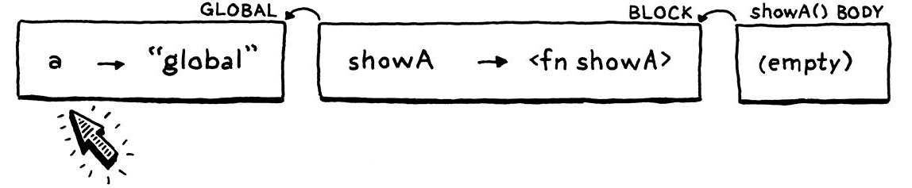

      1. The interpreter dynamically creates a new environment for the function body of `showA()`. It’s empty since that function doesn’t declare any variables.
      2. The parent of that environment is the function’s closure—the outer block environment.
      3. Inside the body of `showA()`, we print the value of `a`.
      4. The interpreter looks up `a`’s value by walking the chain of environments. It gets all the way to the global environment before finding it there and printing "global".

   4. We declare the second `a`, this time inside the block:

      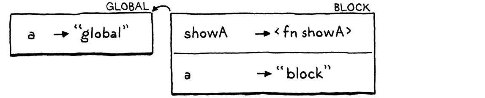

      - It’s in the same block—the same scope—as `showA()`, so it goes into the same environment, which is also the same environment `showA()`’s closure refers to.

   5. We call `showA()` again:

      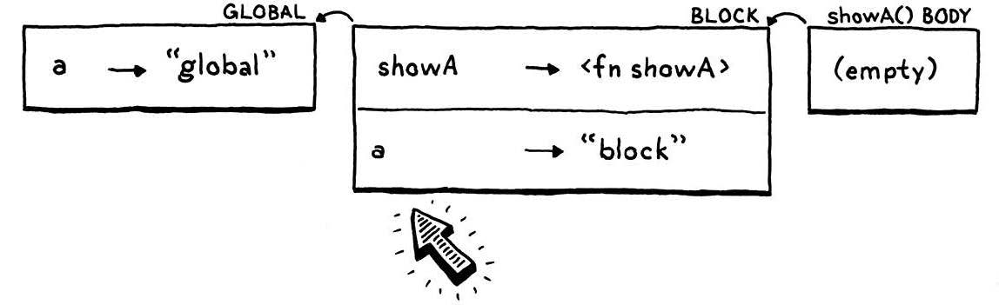

      1. We create a new empty environment for the body of `showA()` again, wire it up to that closure, and run the body.
      2. When the interpreter walks the chain of environments to find `a`, it now discovers the new `a` in the block environment (block one).

4. Persistent environments

   - There is a style of programming that uses what are called persistent data structures.
     persistent data structure can never be directly modified. Instead, any “modification” to an existing structure produces a brand new object that contains all of the original data and the new modification. The original is left unchanged.

   - If we were to apply that technique to Environment, then every time you declared a variable it would return a new environment that contained all of the previously-declared variables along with the one new name.

   - Declaring a variable would do the implicit “split” where you have an environment before the variable is declared and one after:

   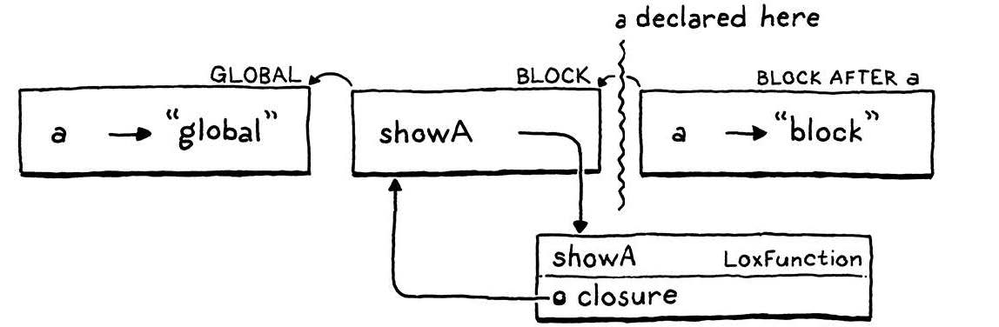

   - A closure retains a reference to the Environment instance in play when the function was declared. Since **any later declarations in that block would produce new Environment objects, the closure wouldn’t see the new variables and our bug would be fixed.**

5. Semantic Analysis

   - We know static scope means that a variable usage always resolves to the same declaration, which can be determined just by looking at the text. Given that, why are we doing it dynamically every time? Doing so doesn’t just open the hole that leads to our annoying bug, it’s also needlessly slow.

   - A better solution is to resolve each variable use once. Write a chunk of code that inspects the user’s program, finds every variable mentioned, and figures out which declaration each refers to. This process is an example of a semantic analysis. Where a parser only tells if a program is grammatically correct—a syntactic analysis—semantic analysis goes farther and starts to figure out what pieces of the program actually mean. In this case, our analysis will resolve variable bindings. We’ll know not just that an expression is a variable, but which variable it is.

   - we’ll store the resolution in a way that makes the most out of our existing Environment class. Recall how the accesses of a are interpreted in the problematic example:

   

   - In the first (correct) evaluation, **we look at three environments in the chain before finding the global declaration of a.** Then, when the inner a is later declared in a block scope, it shadows the global one:

   

   - The next look-up walks the chain, finds a in the second environment and stops there. If we could ensure a variable lookup **always walked the same number of links in the environment chain, that would ensure that it found the same variable in the same scope every time.**

   - To “resolve” a variable usage, we only need to calculate how many “hops” away the declared variable will be in the environment chain.

6. A variable resolution pass

   - After the parser produces the syntax tree, but before the interpreter starts executing it, we’ll do a single walk over the tree to resolve all of the variables it contains.

   - Additional passes between parsing and execution are common. If Lox had static types, we could slide a type checker in there. Optimizations are often implemented in separate passes like this too.

7. static analysis is different from a dynamic execution:

   - **There are no side effects**. When the static analysis visits a print statement, it doesn’t actually print anything. Calls to native functions or other operations that reach out to the outside world are stubbed out and have no effect.

   - **There is no control flow.** Loops are only visited once. Both branches are visited in if statements. **Logic operators are not short-circuited**.

8. A Resolver Class

   The resolver needs to visit every node in the syntax tree, it implements the visitor abstraction we already have in place. Only a few kinds of nodes are interesting when it comes to resolving variables:

   1. A block statement introduces a new scope for the statements it contains.

   2. A function declaration introduces a new scope for its body and binds its parameters in that scope.

   3. A variable declaration adds a new variable to the current scope.

   4. Variable and assignment expressions need to have their variables resolved.

   The rest of the nodes don’t do anything special, but we still need to implement visit methods for them that traverse into their subtrees.

   - The scope stack is only used for local block scopes. Variables declared at the top level in the global scope are not tracked by the resolver since they are more dynamic in Lox. When resolving a variable, if we can’t find it in the stack of local scopes, we assume it must be global.

   - This is a compile error in lox :
     ```js
     var a = "outer";
     {
       var a = a;
     }
     ```

9. Interpreting Resolved Variables
   Let’s see what our resolver is good for. Each time it visits a variable, it tells the interpreter how many scopes there are between the current scope and the scope where the variable is defined. At runtime, this corresponds exactly to the number of environments between the current one and the enclosing one where the interpreter can find the variable’s value.

## Chapter 12: Classes

1. Class Declarations

   - A class statement introduces a new name, so it lives in the declaration grammar rule.

   ```c
   program → declaration* EOF ;
   declaration → classDecl | funDecl | varDecl | statement ;
   classDecl → "class" IDENTIFIER "{" function* "}" ;
   funDecl → "fun" function ;
   function → IDENTIFIER "(" parameters? ")" block ;
   parameters → IDENTIFIER ( "," IDENTIFIER )* ;
   statement → exprStmt | forStmt | ifStmt | printStmt | returnStmt | whileStmt | block ;
   returnStmt → "return" expression? ";" ;
   forStmt → "for" "(" ( varDecl | exprStmt | ";" ) expression? ";" expression? ")" statement ;
   whileStmt → "while" "(" expression ")" statement ;
   ifStmt → "if" "(" expression ")" statement ( "else" statement )? ;
   block → "{" declaration* "}" ;
   exprStmt → expression ";" ;
   printStmt → "print" expression ";" ;
   ```

   - Unlike function declarations, methods don’t have a leading _fun_ keyword. Each method is a name, parameter list, and body. Here’s an example:

   ```js
    class Breakfast {
      cook() {
      print "Eggs a-fryin'!";
    }
      serve(who) {
      print "Enjoy your breakfast, " + who + ".";
    }
   }
   ```

2. We’ll use call expressions on class objects to create new instances.

   ```js
   class Bagel {}
   var bagel = Bagel();
   print bagel; // Prints "Bagel instance".
   ```

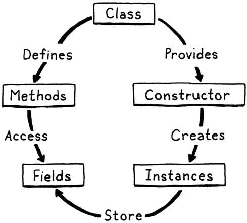

3.  Allowing code outside of the class to directly modify an object’s fields goes against the object-oriented credo that a class encapsulates state.

    - java example

      ```java
        public class EncapsulationExample {

        public String publicField; // Avoid making fields public, use private instead
        private int privateField;

        public EncapsulationExample(String publicField, int privateField) {
            this.publicField = publicField;
            this.privateField = privateField;
        }

        public int getPrivateField() {
            return privateField;
        }

        public void setPrivateField(int privateField) {
            this.privateField = privateField;
        }
      }

        public class Main {

          public static void main(String[] args) {
              EncapsulationExample example = new EncapsulationExample("Public", 42);

              // Directly modifying public field (violating encapsulation)
              example.publicField = "Modified Public";

              // Accessing and modifying private field using getter and setter (encapsulation maintained)
              int privateFieldValue = example.getPrivateField();
              privateFieldValue = privateFieldValue * 2;
              example.setPrivateField(privateFieldValue);

              // Displaying the results
              System.out.println("Public Field: " + example.publicField);
              System.out.println("Private Field: " + example.getPrivateField());
          }
      }
      ```

4.  Methods on the instance’s class can access and modify properties, but so can outside code. Properties are accessed using a . syntax.

    ```js
    someObject.someProperty;
    ```

    - That dot has the same precedence as the parentheses in a function call expression so we slot it into the grammar by replacing the existing _call_ rule with:

      ```c
      expression → assignment ;
      assignment → IDENTIFIER "=" assignment | logic_or ;
      logic_or → logic_and ( "or" logic_and )* ;
      logic_and → equality ( "and" equality )* ;
      equality → comparison ( ( "!=" | "==" ) comparison )* ;
      comparison → term ( ( ">" | ">=" | "<" | "<=" ) term )* ;
      term → factor ( ( "-" | "+" ) factor )* ;
      factor → unary ( ( "/" | "*" ) unary )* ;
      unary → ( "!" | "-" ) unary | call ;
      call → primary ( "(" arguments? ")" | "." IDENTIFIER )* ;
      arguments → expression ( "," expression )* ;
      primary → "true" | "false" | "nil" | NUMBER | STRING | "(" expression ")" | IDENTIFIER ;
      ```

      - After a primary expression, we allow a series of any mixture of parenthesized calls and dotted property accesses. “Property access” is a mouthful, so from here on out, we’ll call these “get expressions”.

      - In Lox, only instances of classes have properties.

5.  what happens if the instance doesn’t have a property with the given name -> we’ll make it a runtime error.

6.  “properties” and “fields” there is a subtle difference between the two.

    - **Fields** are named bits of state stored directly in an instance.
    - **Properties** are the named things, that a get expression may return.
      Every field is a property, but not every property is a field.

      ```js
      class Person {
        sayName() {
          print this.name;
          }
        }
        var jane = Person();
        jane.name = "Jane";
        var method = jane.sayName;
        method(); // Jane
      ```

      `this.name` suggests that `name` is a field of the `Person` class.
      `name` is also a property.

      - another example

      ```js
      class Person {
        // Computed Property
        fullName() {
          return "Full Name: " + this.name;
        }

        sayName() {
          print(this.name);
        }
      }

      var jane = Person();
      jane.name = "Jane";

      var method = jane.sayName;
      method(); // Jane

      // Accessing the computed property
      print(jane.fullName()); // Full Name: Jane
      ```

7.  Set expressions: Setters use the same syntax as getters, except they appear on the left side of an assignment.

    ```js
    someObject.someProperty = value;
    ```

    - In grammar land, we extend the rule for assignment to allow dotted identifiers on the left-hand side.

    ```c

      expression → assignment ;
      assignment → ( call "." )? IDENTIFIER "=" assignment | logic_or;
      logic_or → logic_and ( "or" logic_and )_ ;
      logic_and → equality ( "and" equality )_ ;
      equality → comparison ( ( "!=" | "==" ) comparison )_ ;
      comparison → term ( ( ">" | ">=" | "<" | "<=" ) term )_ ;
      term → factor ( ( "-" | "+" ) factor )_ ;
      factor → unary ( ( "/" | "_" ) unary )_ ;
      unary → ( "!" | "-" ) unary | call ;
      call → primary ( "(" arguments? ")" | "." IDENTIFIER )_ ;
      arguments → expression ( "," expression )\* ;
      primary → "true" | "false" | "nil" | NUMBER | STRING | "(" expression ")" | IDENTIFIER ;

    ```

    - Unlike getters, setters don’t chain. However, the reference to call allows any high precedence expression before the last dot, including any number of getters, as in:

    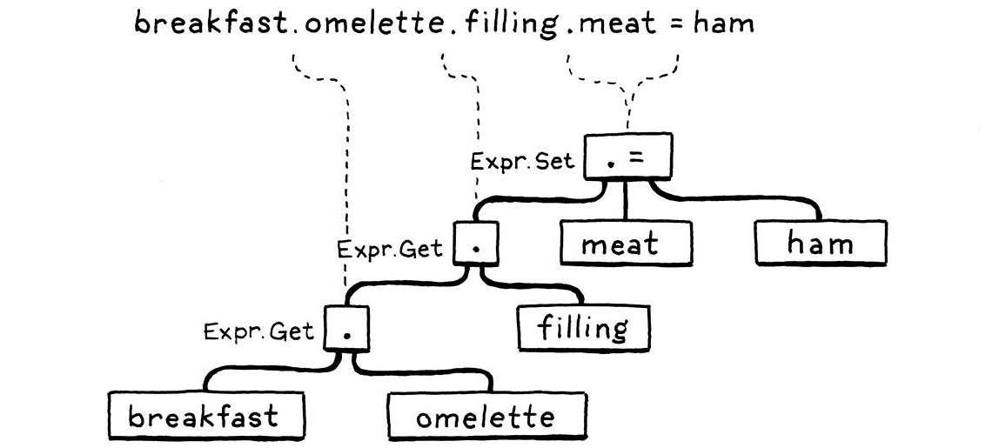

    **Note** here that only the last part, the .meat is the setter. The .omelette and .filling parts are both get expressions.

8.  Methods on Classes

    - This program creates an instance and then stores a function in a field on it.Then it calls that function using the same syntax as a method call.

    ```js
      class Box {
        namefun () {
          this.name;
        }
      }

      fun notMethod(argument) {
        print "called function with " + argument;
      }

      var box = Box();
      box.function = notMethod;
      box.function("argument"); // called function with argument

      box.name = "boxname";

      print (box.name); // boxname
    ```

    ```js
      class Person {
        sayName() {
          print this.name;
        }
      }
      var jane = Person();
      jane.name = "Jane";
      jane.sayName(); // jane
      var bill = Person();
      bill.name = "Bill";
      bill.sayName(); // Bill

      bill.sayName = jane.sayName;
      bill.sayName(); // Jane
    ```

    ```js
      class Egotist {
        speak() {
          print this;
        }
      }

      var method = Egotist().speak;
      method(); // Egotist instance
    ```

## Chapter 13: Inheritance

1. we’ll use a less than sign (<).

   - BostonCream inherit from Doughnut

   ```js
   class Doughnut {
   // General doughnut stuff...
   }
   class BostonCream < Doughnut {
   // Boston Cream-specific stuff...
   }
   ```

   - To work this into the grammar, we add a new optional clause in our existing classDecl rule.

   ```c

   program → declaration* EOF ;
   declaration → classDecl | funDecl | varDecl | statement ;
   classDecl → "class" IDENTIFIER ( "<" IDENTIFIER )? "{" function* "}" ;
   funDecl → "fun" function ;
   function → IDENTIFIER "(" parameters? ")" block ;
   parameters → IDENTIFIER ( "," IDENTIFIER )* ;
   statement → exprStmt | forStmt | ifStmt | printStmt | returnStmt | whileStmt | block ;
   returnStmt → "return" expression? ";" ;
   forStmt → "for" "(" ( varDecl | exprStmt | ";" ) expression? ";" expression? ")" statement ;
   whileStmt → "while" "(" expression ")" statement ;
   ifStmt → "if" "(" expression ")" statement ( "else" statement )? ;
   block → "{" declaration* "}" ;
   exprStmt → expression ";" ;
   printStmt → "print" expression ";" ;

   ```

   - After the class name, you can have a < followed by the superclass’s name. The superclass clause is optional because you don’t have to have a superclass. Unlike some other object-oriented languages like Java, Lox has no root “Object” class that everything inherits from, so when you omit the superclass clause, the class has no superclass, not even an implicit one.

   - We want to capture this new syntax in the class declaration’s AST node.
     tool/GenerateAst.java
     in main()

   ```java
    "Class : Token name, Expr.Variable superclass," +
    " List<Stmt.Function> methods",
   ```

   > You might be surprised that we store the superclass name as an **Expr.Variable**, not a **Token**. The grammar restricts the superclass clause to a single identifier, but **at runtime, that identifier is evaluated as a variable access.** Wrapping the name in an Expr.Variable early on in the parser gives us an object that the resolver can hang the resolution information off of.

2. Lox allows class declarations even inside blocks, so it’s possible the superclass name refers to a local variable. In that case, we need to make sure it’s resolved.

## Chapter 14: Chunks of Bytecode

## Chapter 15: A Virtual Machine

## Midterm Exam

1. Describe the inputs and outputs of both the scanner and parser

   **Answer**

   1. **Scanner**

   - **Input:** Characters (string)
   - **Output:** Tokens

   2. **Parser**

   - **Input:** Tokens
   - **Output:** Abstract Syntax Trees (ASTs)

2. What parsing algorithm is used for Lox ? What is its main features ? give a brief description of it

   **Answer**

   1. Recursive Descent

   2. Recursive descent parsing is often implemented with predictive parsing, where the parser can predict which production rule to apply based on the current input token. This makes the parsing process more efficient.

   3. Recursive descent is considered a top-down parser because it starts from the top or outermost grammar rule (here expression) and works its way down into the nested subexpressions before finally reaching the leaves of the syntax tree. This is in contrast with bottom-up parsers like LR that start with primary expressions and compose them into larger and larger chunks of syntax. A recursive descent parser is a literal translation of the grammar’s rules straight into imperative code. Each rule becomes a function.

3. What is the purpose of this code ? where does it fit in Lox ?

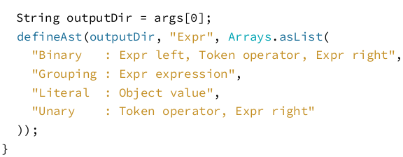

**Answer**

- This code serves the purpose of generating the `Expr` class to facilitate the implementation of the visitor pattern. By employing this generated class, one can implement specific functions for each class in the interpreter or utilize alternative approaches, similar to how it was done with the resolver. In the context of Lox, this code contributes to building the necessary infrastructure for handling different expression types within the language.

4. Why in C you can’t call a function above the code that defines it unless you have an explicit forward declaration ?

   **Answer**

   - In C, the compiler processes the source code in a single pass, meaning it reads the code from top to bottom. When it encounters a function call, it needs to know the function's signature (return type, parameter types) and name. If the function has not been declared or defined yet, the compiler would not have this information.

5. What is the lookahead of the scanner ? is it better to have larger or smaller lookaheads ? What is the lookahead of Lox ?

   **Answer**

   1. Lookahead in Scanners:

      Meaning: The lookahead of a scanner refers to the number of characters it can examine ahead of its current position without actually consuming them. It aids in making informed decisions about token formation.
      `peek()` and `peekNext()` are lookaheads of the scanner

   2. Optimal Size:

      Smaller lookaheads (1-2 characters) are generally preferred for efficiency.
      Larger lookaheads might be necessary for certain language constructs but can impact speed.

   3. Lox's Lookahead

      Lox's scanner uses a lookahead of 1 character. This is sufficient for its lexical grammar, as it doesn't have complex constructs that require extensive lookahead.

6. Say you want to implement Pascal, C, and Fortran compilers, and you want to target x86, ARM, and, SPARC

   1. How many full compilers would you need to write if you wrote each one independenlty ?
   2. What changes if you decided using an intermediate representation ?

   **Answer**

   1. 9 full compilers
   2. number of full compilers will be 3 full compilers

7. In Lox, If you try to perform an operation on values of the wrong type - say, dividing a number by a string -

   1. When is the error detected ?
   2. When it is reported ?
   3. This means Lox's type system is static or dynamic or flexible ?

   **Answer**

   1. the error detected at runtime
   2. error is reported when the code is executed
   3. dynamic

8. What is this image trying to say ? give examples...


**Answer**

- In a top-down parser, you reach the lowest-precedence expressions first because they may in turn contain subexpressions of higher precedence.
  Equality is the top of the grammar , it means we start our grammar from it because it has the lowest precedence like we say : if 5 == (5+2) we culc 5+2 first and then we compare it with 5 and like true == !false, !false is a unary it has higher precedence than equality but it comes after it in the grammar. and so on with comparison, addition, and multiplication.

9. 1. What does this code try to achieve ?
   2. Why do we need a loop here ? what if we removed the while statement and executed the loop one time only ?

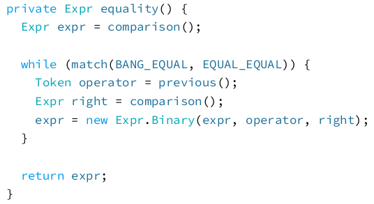

**Answer**

1. this code implements the grammar of equality , the equality has a lower precedence than comparison , if we found a BANG_EQUAL or EQUAL_EQUAL (!= or ==) (the equality) we just return the comparison expr if we found BANG_EQUAL or EQUAL_EQUAL we store the operator token and the right expr and create new binary expr. 5 == 6 like this its a binary expr the right is 6 and the operator token is == and the expr is the 5. may be look like this 25 + 5 /2 == 25 +3/3.

2. we need the loop here to match all the operators we have like this 5 == 2 != 3 == 5 , if we used it once we cannot eacute more than one operator.
